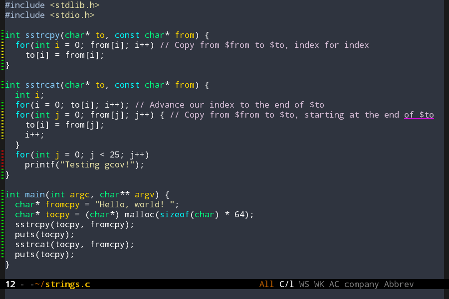

[](https://travis-ci.org/AdamNiederer/cov)
[](http://melpa.org/#/cov)

# cov
`cov` shows code coverage data for your program in emacs. Currently,
it supports gcov and lcov output, as well as the Coveralls format
produced by [undercover.el](https://github.com/sviridov/undercover.el).


## Installation
cov is on MELPA. To install it, type `M-x package-install RET cov RET`

## Usage
Enable `cov-mode` in a buffer. It looks for a file with the same name
as the buffer file with the suffix '.gcov', or a `coverage-final.json`
file, in the same directory.

## Customization
By default, cov will run in profiling mode. Lines which are executed a
lot will be decorated with `cov-heavy-face`, while lines executed less
will be decorated with `cov-med-face` and `cov-light-face`. Lines not
executed at all will be decorated with `cov-none-face`.

Setting `cov-coverage-mode` to `t` will run cov in coverage mode. In
this mode, if a line is run, `cov-coverage-run-face` will be applied
to the line, while `cov-coverage-not-run-face` will be applied to
lines which were not run. Coverage mode should make finding uncovered
lines slightly easier than profiling mode.

- `cov-high-threshold` - If a line is run more than
  (`cov-high-threshold` * 100) percent of the time compared to the
  most-executed line, cov will decorate it with `cov-heavy-face`.
- `cov-med-threshold` - If a line is run more than
  (`cov-med-threshold` * 100) percent of the time compared to the
  most-executed line, cov will decorate it with `cov-med-face`. This
  should be less than `cov-heavy-face`
- `cov-coverage-mode` - If set, cov will ignore execution frequencies
  and simply decorate whether a line was executed. Executed lines are
  decorated with `cov-coverage-run-face`, while lines not-executed
  lines are decorated with `cov-coverage-not-run-face`

### Coverage File

The coverage tool adds a postfix to the source file name to store the
coverage data. For example, `gcov` adds `.gcov` to the file name. This
postfix is the default that `gcov-mode` uses in order to locate the
data. You can customize this default by setting the alist
`gcov-coverage-alist`, which bind postixes the coverage tools:

```lisp
(setq gcov-coverage-alist '((".gcov" . gcov)))
```

If the coverage file is not stored in the same directory as the source
file, the list `gcov-coverage-file-paths` can be set to contain
additional paths, relative to the source path, to search. For example,
with this configarion the current directory and the subdirectory `cov`
will be used:

```lisp
(setq gcov-coverage-file-paths '("." "cov")))
```

To set the variable to project specific values, e.g. in
`.dir-locals.el` file, you can make that variable buffer local by
adding this to your init.el:

```lisp
(make-variable-buffer-local 'gcov-coverage-file-paths)
```

For more complex environments it is also possible to provide a
function instead ot a path string. The function will be called with
the path and name of the buffer file and should return a cons cell of
the form (COV-FILE-PATH . COVERAGE-TOOL). PATH shall be the full path
and name of the coverage data file. COVERAGE-TOOL shall specify the
coverage tool.

## Develop

`cov.el` can be extended to understand more coverage formats. To add
a new format:

1. Add a function to `cov-coverage-file-paths` that locates a coverage
   file for a given file. If a coverage file is found, it should
   return a cons of the coverage file path and an identifier, like
   `(cons filepath 'mytool)`. The original name of the file can be
   found in the `cov-coverage-file` buffer local variable.
2. Implement a `cov--mytool-parse`. The parse function is called with
   a temp buffer with the coverage file data as `(current-buffer)` and
   should parse the data and return the coverage as a alist of files
   to coverage mapping. Coverage data is simply a list of two element
   lists, where the first element is the line number and the second
   the coverage count.

### Test
Install dependencides:
```bash
cask install
```

Run tests:
```bash
cask exec ert-runner
```

## License
GPLv3+
